**Get Started**

SDK của 1Pay (1PaySDK) là bộ công cụ phát triển phần mềm được thiết kế để
giúp các nhà phát triển (developer) tích hợp hệ thống thanh toán (sms, sms plus,
card,…) vào các sản phẩm trên nền tảng di động (Android, Window Phone, IOS).

1PaySDK hỗ trợ giao diện thanh toán đơn giản tiện lợi, bộ thư viện linh hoạt giúp
cho nhà phát triển có thể nhanh chóng tính hợp thanh toán vào sản phẩm (trò
chơi, ứng dụng,…).

**Các bước tích hợp SDK:**

​1. Import SDK vào project

​2. Cấu hình SDK và Tích hợp

**1. Tải và Import SDK vào project**

- Đăng nhập trang http://1pay.vn, vào “Quản trị sản phẩm” để xem thông tin sản phẩm
cần tích hợp các hình thức thanh toán.

	Lưu ý: Các hình thức thanh toán(httt) của sản phẩm đã được xác nhận (màu xanh) sẽ hiển thị trong 1PaySDK.
Trong quá trình phát triển kinh doanh, nếu merchant bổ sung hình thức thanh toán thì merchant chỉ cần được
1Pay xác nhận httt mới là có thể sử dụng.

- Truy cập http://dev.1pay.vn/sdk/, bấm nút Source Project (bên phải nút Android
Demo), chọn sản phẩm cần tích hợp thanh toán để tải thư viện 1PaySDK-Android_
[Tên SP].zip.

- Giải nén thư mục 1PaySDK vào cùng thư mục chứa source code của sản phẩm cần tích
hợp thanh toán.

- Sau đó tiến hành import 1PaySDK-Android vào eclipse.

**2. Cấu hình SDK**

2.1. Khởi tạo

2.1.1.Thêm thư viện cho ứng dụng

Trên eclipse trong cửa sổ Package Explorer click chuột phải vào source code của mình,
chọn Properties/Android, chọn nút Add và chọn thư viện 1PaySDK-Android vừa thêm
vào.

2.1.2.Thêm quyền truy cập Internet, gửi tin Sms cho thiết bị

Copy các dòng sau vào file AndroidManifest.xml:

```xml
 <uses-permission android:name="android.permission.INTERNET" />
 <uses-permission android:name="android.permission.SEND_SMS" />
 <uses-permission android:name="android.permission.ACCESS_NETWORK_STATE" />
 <uses-permission android:name="android.permission.CHANGE_NETWORK_STATE"/>
 <uses-permission android:name="android.permission.CHANGE_W IFI_STATE"/>
 <uses-permission android:name="android.permission.READ_PHONE_STATE"/>
```
2.1.3.Tạo biến m1PaySDK

Trong class khởi chạy dịch vụ
(Khai báo trong thẻ activity, trước dòng <action android:name= “android.intent.action.MAIN" />)

Thêm dòng sau:

<code>private M1PaySDK m1PaySDK;</code>

2.1.4.Khởi tạo giá trị ban đầu cho biến m1PaySDK

Tạo hàm loadsConfig1PaySDK(..), trong class khởi chạy dịch vụ.

```xml
public void loadsConfig1PaySDK() {

m1PaySDK = new M1PaySDK(this);

… // thêm các câu lệnh để chỉnh sửa 1PaySDK tại đây

m1PaySDK.start(new TransactionCallBack() {

	@Override

	public void callBack(boolean result, String msg) {

	}

 });

}
```

2.1.5.Gọi hiển thị giao diện thanh toán

Thêm dòng sau vào sự kiện bấm nút thanh toán

<code>loadsConfig1PaySDK();</code>

2.2. Hướng dẫn thay đổi các thông tin

(Tất cả công việc dưới đây đều thực hiện trong hàm loadsConfig1PaySDK(…) vừa tạo).

2.2.1.Thiết lập ban đầu

a.Thay đổi phông chữ

<code>m1PaySDK.setTextStyle(Loại phông chữ)</code>

Dùng khi muốn thay phông chữ cho giao diện
thanh toán.

Lưu ý:

- Phần giới thiệu ở màn hình chính và màn hình chi tiế
nhận phông chữ mặc định trên thiết bị, không thay đổ
được.

- Chỉ chấp nhận kiểu chữ định dạng .ttf
Ví dụ thay phông chữ của màn hình thanh
toán sang phông voy.ttf

- Bước 1: dán phông chữ “voy.ttf” vào thư
mục asset/fonts trong sản phẩm cần cài đặ
thanh toán.

- Bước 2: vào code thêm dòng sau
Typeface tf = Typeface.createFromAsset
(getAssets(), "fonts/voy.ttf");
m1PaySDK.setTextStyle(tf);

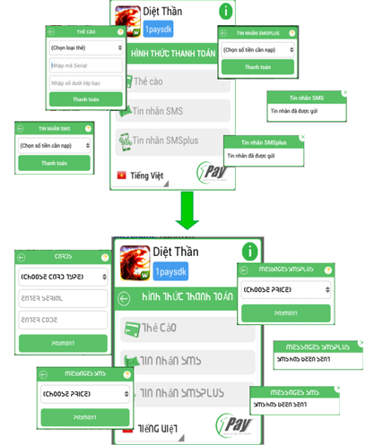&nbsp;

b.Thay đổi icon cho sản phẩm

- Đối với icon đại diện game (hình góc trên, bên
trái màn hình chính) phải đặt tên logo.png và có
kích thước tương ứng, đặt trong các thư mục

1PaySDK project -> res như sau:

	- drawable: 50x50
	- drawable-hdpi: 85x85
	- drawable-large: 135x135
	- drawable-mdpi: 55x55
	- drawable-xhdpi: 150x150
	- drawable-xxhpi: 185x185

- Để thay đổi icon khác, vào thư mục 1PaySDK
project->res/drawable để thay các icon mới
với tên và kích thước tương ứng các icon cũ.

Lưu ý: để định dạng png cho tất cả các hình ảnh

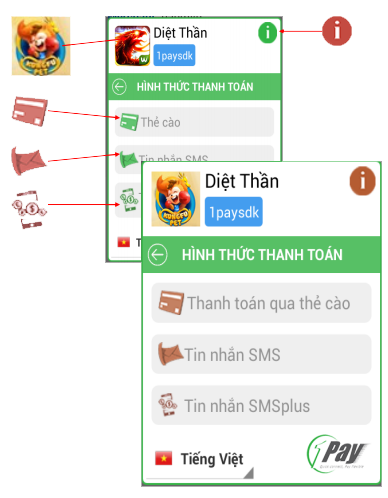&nbsp;


c.Thay đổi tên sản phẩm

<code>setAppName(Tên sản phẩm)</code>

Thay đổi tên sản phẩm hiển thị trên giao
diện chính của màn hình thanh toán.

Ví dụ:

<code>m1PaySDK.setAppName("Kungfu Pet");</code>

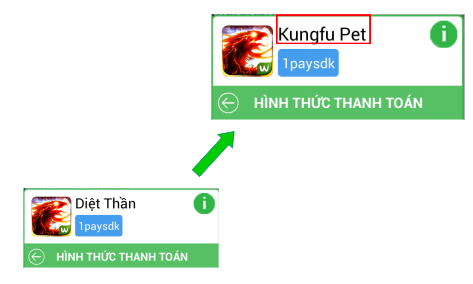&nbsp;

d.Thay đổi tên người chơi

<code>setAccountName(Tên người chơi)</code>

Thay đổi tên người chơi hiển thị trên giao
diện chính của màn hình thanh toán.

Ví dụ:

<code>m1PaySDK.setAccountName("1Pay - Kungfu Pet");</code>

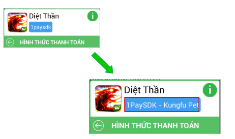&nbsp;

2.2.2.Thiết lập ngôn ngữ

b.Bật/tắt chuyển ngữ

<code>setEnableLangueChange(Lựa chọn)</code>

Bật/tắt chế độ hỗ trợ chuyển ngôn ngữ trên
giao diện thanh toán của 1PaySDK. Có 2 giá
trị true và false

Ví dụ:

<code>m1PaySDK.setEnableLangueChange(false);</code>

a.Thiết lập ngôn ngữ mặc định

<code>m1PaySDK.setLanguage(Ngôn ngữ)</code>

Có hai giá trị để thiết lập ngôn ngữ:
- Tiếng việt: vi
- Tiếng Anh: en_US

Ví dụ:

<code>m1PaySDK.setLanguage("en_US");</code>

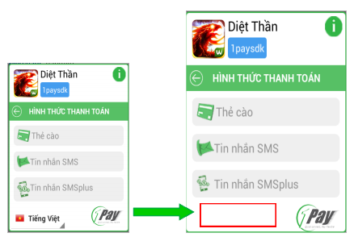&nbsp;

2.2.3.Thiết lập thanh toán

a.Bật/tắt hình thức thanh toán(httt)

Bật/tắt các httt khi hiển thị màn hình thanh toán.

- Thẻ cào: setEnableCardCharging(lựa chọn)
- Sms: setEnableSmsCharging(lựa chọn)
- Sms plus: setEnableSmsPlusCharging(lựa chọn)

Ví dụ tắt httt Sms plus:

<code>m1PaySDK.setEnableSmsPlusCharging(false);</code>

Lưu ý: Các httt đã được xác nhận thì mới có thể tắt/bật

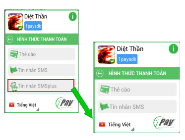&nbsp;

b.Thay đổi loại thẻ cào

<code>setListTypeCard(danh sách thẻ)</code>

Nhằm cấu hình danh sách nhà mạng hiển thị trong
phần chọn thẻ cào.

Ví dụ sản phẩm cần tích hợp chỉ chạy thẻ cào Viettel,
Vinaphone, Gate:

<code>
private M1PaySDKConstant m;
...
m = new M1PaySDKConstant();
ArrayList<String> listCard = new ArrayList<String>();
listCard.add(m.TypeCardViettel);
listCard.add(m.TypeCardVinaphone);
listCard.add(m.TypeCardGate);
m1PaySDK.setListTypeCard(listCard);
</code>

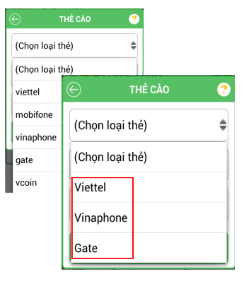&nbsp;

c.Thay đổi dải mệnh giá sms

<code>setListTypeCard(danh sách mệnh giá sms)</code>

Nhằm cấu hình dải mệnh giá sms hiển thị cho khách
hàng chọn để gửi tin.

Ví dụ: cấu hình sms có 3 mệnh giá 500, 1000, 2000:

<code>private M1PaySDKConstant mconstant;
...
mconstant = new M1PaySDKConstant();
ArrayList<String> listSms = new ArrayList<String>();
listSms.add(mconstant.SMS500);
listSms.add(mconstant.SMS1000);
listSms.add(mconstant.SMS2000);
m1PaySDK.setListShortCodeSms(listSms);
</code>

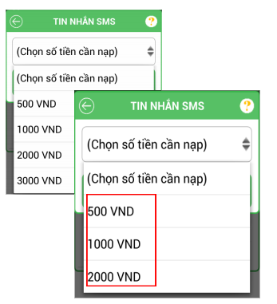&nbsp;

d.Thay đổi nội dung tin nhắn sms

<code>setExchangeOtherInformationSms(Nội dung);</code>

Nhằm cấu hình nội dung sau mã sms đã đăng ký để tạo tin
nhắn với nội dung phù hợp kịch bản kinh doanh.

Ví dụ:

- Mã đăng ký trên 1Pay: Andev, đầu số 8xx8.
- Cần cấu hình nội dung tin nhắn: “Andev game1 account1”
gửi 8x38:
m1PaySDK.setExchangeOtherInformationSms("game1 account1");

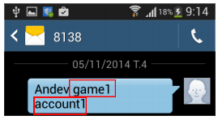&nbsp;

e.Thay đổi dải mệnh giá sms plus
setListshortCodeSmsPlus(danh sách mệnh giá);
Nhằm cấu hình dải mệnh giá sms plus hiển thị cho khách
hàng chọn để gửi tin.
Ví dụ:
- Sản phẩm chỉ áp dụng mệnh giá 1000, 2000, 3000 cho httt
sms plus:

<code>
private M1PaySDKConstant mconstant;
...
mconstant = new M1PaySDKConstant();
ArrayList<String> listSmsPlus = new ArrayList<String>();
listSmsPlus.add(mconstant.SMSPLUS1000);
listSmsPlus.add(mconstant.SMSPLUS2000);
listSmsPlus.add(mconstant.SMSPLUS3000);
m1PaySDK.setListShortCodeSmsPlus(listSmsPlus);
</code>
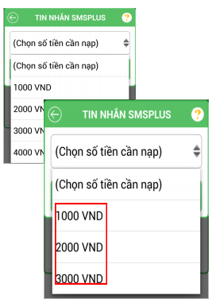&nbsp;

f.Thay đổi nội dung sms plus

<code>setExchangeOtherInformationSmsPlus(Nội dung);</code>

Nhằm cấu hình nội dung sau mã sms plus đã đăng ký để
tạo tin nhắn với nội dung phù hợp kịch bản kinh doanh.

Ví dụ:
- mã sms plus đã đăng ký: gametest
- cần cấu hình thông tin khác là “Game01” 9029:
m1PaySDK.setExchangeOtherInformationSmsPlus("Game01");

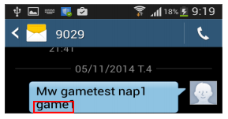&nbsp;

2.2.4.Thay đổi giao diện

a.Thay đổi định dạng giao diện chung

Thay đổi màu nền (tất cả giao diện)
initTheme(Màu nền giao diện thanh toán, Màu
đường viền, Màu chữ, Độ cong của giao diện thanh
toán, Độ rộng của đường viền).

Ví dụ:

<code>m1PaySDK.initTheme("#fcf2d4","#721301",“#721301",10,5);</code>

Lưu ý:

- Muốn bỏ định dạng đã chỉnh sửa, trở lại giao diện
mặc định ban đầu, ta dùng hàm sau:

<code>m1PaySDK.removeInitThem(true);</code>

- Ba giá trị đầu tiên phải để dạng màu hexa 7 chữ cái
(Ví dụ: #fcf2d4)


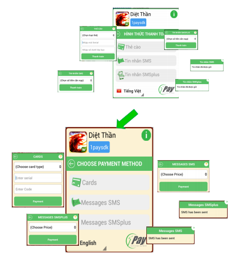&nbsp;

b.Thay đổi tiêu đề cho các hình thức thanh toán

- Đổi tên tiêu đề Thẻ cào:

<code>setTitleCardCharging(Tiêu đề);</code>

- Đổi tên tiêu đề Sms:

<code>setTitleSmsCharging(Tiêu đề);</code>

- Đổi tên tiêu đề Sms Plus:

<code>setTitleSmsPlusCharging(Tiêu đề);</code>

Ví dụ:

<code>m1PaySDK.setTitleCardCharging(“Thanh toán qua thẻ cào");</code>

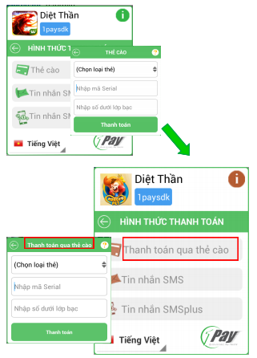&nbsp;

Lưu ý:
- Đối với trường hợp cần tạo giao diện đa ngôn ngữ (Tiếng Anh và Tiếng Việt), truy cập vào tập tin 1PaySDK Project -> res/value/
strings.xml và 1PaySDK Project -> res/value-en/strings.xml, tạo các thẻ xml mới. Truyền giá trị thẻ xml vào câu lệnh thay
bằng giá trị String thông thường.
Ví dụ thay đổi tiêu đề thẻ cào (đa ngôn ngữ)
+ Bước 1: Tạo thẻ card_name trong file value/strings.xml
<string name="card_name">Thanh toán qua thẻ cào</string>
và value-en/strings.xml
<string name="card_name">Payment for card</string>
+ Bước 2: Thêm câu lệnh:
m1PaySDK.setTitleCardCharging(this.getResources().getString(R.string.card_name));

c.Thay đổi định dạng tiêu đề (chung)
setColorBackgroundTitle(màu nền, màu chữ, kiểu chữ đậm nhạt)
Nhằm thay đổi định dạng của tiêu đề trên màn hình chính và màn hình chi tiết.
Trong đó:

Màu nền: Màu nền của tiêu đề, dạng màu hexa 7 chữ

Màu chữ: Màu chữ trên tiêu đề, dạng màu hexa 7 chữ

Kiểu chữ đậm nhạt: Quy định kiểu chữ nghiêng/đậm/nhạt cho tiêu đề, theo
chuẩn của Android

Ví dụ:


<code>m1PaySDK.setColorBackgroundTitle("#721301", "#ffffff", Typeface.defaultFromStyle</code>

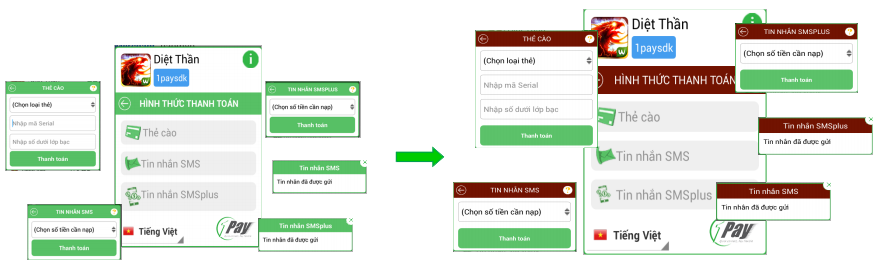&nbsp;

d.Thay đổi định dạng nút thanh toán (màn hình chính)

<code>setColorButtonCardCharging(màu nền, màu chữ, độ cong viền)</code>

Nhằm định dạng hình thức hiển thị của nút httt tương ứng.

Trong đó:

Màu nền: Màu nền của nút, dạng hexa 7 kí tự;

Màu chữ: Màu tiêu đề của nút, dạng hexa 7 kí tự.

Độ cong viền: Độ cong 4 góc của nút, dạng số.

Tương tự với các nút khác:

Sms: 

<code>setColorButtonSmsCharging (…);</code>

Sms Plus:

<code>setColorButtonSmsPlusCharging (…);</code>

Card:

<code>setColorButtonCardCharging(…);</code>

Ví dụ thay đổi định dạng nút Sms plus trên màn hình chính:

<code>m1PaySDK.setColorButtonCardCharging("#ffcd83", "#7b1702", 30);</code>

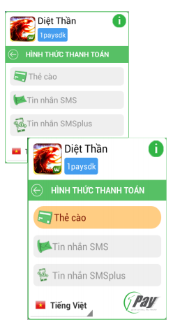&nbsp;

e.Thay đổi phần giới thiệu chung

Nhằm thay đổi thông tin trong phần giới thiệu chung.
Để thay đổi, truy cập vào 1PaySDK project đang sử
dụng, tìm và sửa tập tin layout_about.xml trong hai
thư mục sau:

- Màn hình dọc: res/layout
- Màn hình ngang: res/layout-land

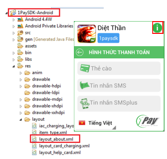&nbsp;

f.Thay đổi phần giới thiệu httt (màn hình chi tiết)

Nhằm thay đổi thông tin trong phần giới thiệu từng httt.
Để thay đổi, truy cập vào 1PaySDK project đang sử dụng, tìm hai
thư mục sau:

- Màn hình dọc: res/layout
- Màn hình ngang: res/layout-land

Có 3 tập tin tương ứng với 3 httt chính, bao gồm:

- Sms: layout_help_sms.xml
- Sms Plus: layout_help_iac.xml
- Thẻ cào: layout_help_card.xml

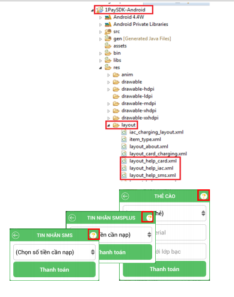&nbsp;

g.Thay đổi định dạng nút (màn hình chi tiết)

<code>setBackgroundColorBtnPayment(màu nền, màu chữ, độ bo góc)</code>

Nhằm thay đổi hiển thị của nút “Thanh toán” trong màn
hình chi tiết từng httt.

Ví dụ:

<code>m1PaySDK.setBackgroundColorBtnPayment("#721301",
"#ffffff", 30);</code>

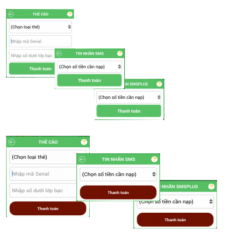&nbsp;


