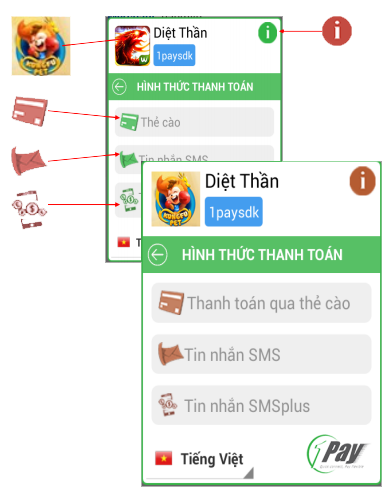
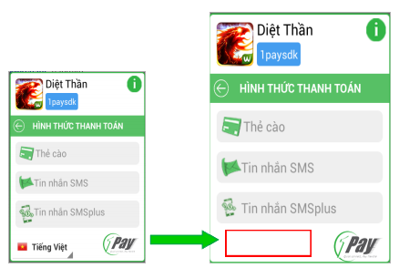
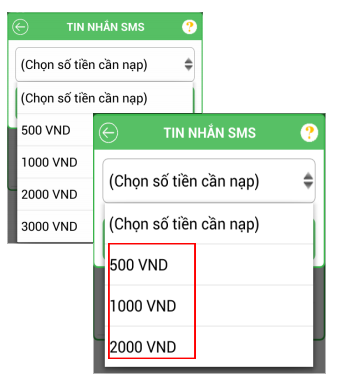
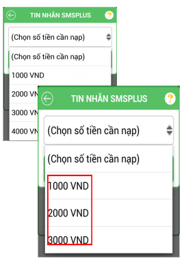
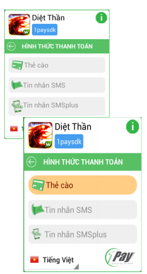

Other languages: [Vietnamese](README.md) | [English](README_EN.md)
**Get Started**

SDK of 1Pay (1PaySDK) is the software development tool built to help developers integrate our payment
system (including: SMS, SMS Plus, Card charging, etc) into their mobile platform (Android, Windows Phone and iOS).
1PaySDK supports a simple and convenient payment interface, a flexible library enabling developers 
to quickly integrate the payment gateway into their products (games, applications, etc).

**Steps to integrate SDK:**

1. Download and import SDK into project

2. Configure SDK and integrate


**1. Download and import SDK into project**

	- Log in http://1pay.vn, click "Product Management" and view the information of product which
	 need to be integrated with payment methods.

	Note: Activated payment services (green) are displayed in 1PaySDK.
	If merchant add more services, they just need the confirmation of 1Pay to be used.

	- Get access to http://dev.1pay.vn/sdk/, click "Source Project" button (in the right of "Android Demo" button),
	choose the product to load the library of 1PaySDK-Android_ [name of product].zip.
	
	- Unzip 1PaySDK folder into the folder containing source code of your product.
	
	- Then import 1PaySDK-Android into the eclipse.

**2. Configure SDK**

2.1. Create

2.1.1. Add library to application

On the eclipse of Package Explorer window, right-click your source code, choose "Properties/ Android", 
click "Add" button and select 1PaySDK-Android library.

2.1.2. Add Internet access permission, send SMS to device

Copy the lines below and paste into the file of AndroidManifest.xml:


```xml
 <uses-permission android:name="android.permission.INTERNET" />
 <uses-permission android:name="android.permission.SEND_SMS" />
 <uses-permission android:name="android.permission.ACCESS_NETWORK_STATE" />
 <uses-permission android:name="android.permission.CHANGE_NETWORK_STATE"/>
 <uses-permission android:name="android.permission.CHANGE_W IFI_STATE"/>
 <uses-permission android:name="android.permission.READ_PHONE_STATE"/>
```
2.1.3. Create variables "m1PaySDK"

In the class launching payment services, if you want to get information from one transaction 
when end user pay via 1PaySDK-Android interface, implement 1PaySDK-M1PaySDKListener.

For example:
```xml 
public class Youractiviy extends Activity implements M1PaySDKListener{
@Override
public void onPucharListener(String charging, String data) {
	//Therein:
    // + charging is payment methods, may be: Card, Sms, SmsPlus
    // + data is string json corresponding to every payment method:
        // Keys of Card are as follows:
            //- type: type of card 
            //- serial: serial number của of card
            //- pin: code of card
            //- message: notification corresponding to card status sent by 1Pay
            //- amount: par value of card
            //- status: status code of card.

        // Keys of SMS and SMS Plus are as follows:
            //- phoneNumber: phone number of message:
            //- contentMessage: message content:
            //- price: par value of message:
	}
}
```
Add the line below:

<code>private M1PaySDK m1PaySDK;</code>

2.1.42.1.4. Create the initial values for variables "m1PaySDK"

Create function loadsConfig1PaySDK(..), in class running services.

```xml
public void loadsConfig1PaySDK() {

m1PaySDK = new M1PaySDK(this);
mOnePaySDK.setListener(this);
… // add commands to edit 1PaySDK here

m1PaySDK.start(new TransactionCallBack() {

    @Override

    public void callBack(boolean result, String msg) {

    }

 });

}

```

2.1.5.Call payment interface display

Add the following line in the event of payment button

<code>loadsConfig1PaySDK();</code>

2.2. Guide to change the information

All of the following steps are performed in the function of loadsConfig1PaySDK(…).

2.2.1. Initial setting

a. Change the font

<code>m1PaySDK.setTextStyle (Type of font) </code>

Use when you want to replace the font for payment interface.

Note:

- The introduction on the main screen and detailed screen 
just accept the default font on device, so do not change.

-Just accept the font format of .ttf.
For example of changing font of payment screen into voy.ttf:

- Step 1: paste “voy.ttf” into the folder of asset/fonts of your product

- Step 2: insert the following line into code
Typeface tf = Typeface.createFromAsset (getAssets(), "fonts/voy.ttf"); m1PaySDK.setTextStyle(tf);


&nbsp;

b.Change icon of product

- Icon of game (image to the upper left of screen) is named logo.png 
and sized respectively on folders 

1PaySDK project -> res, as follows:

	- drawable: 50x50
	- drawable-hdpi: 85x85
	- drawable-large: 135x135
	- drawable-mdpi: 55x55
	- drawable-xhdpi: 150x150
	- drawable-xxhpi: 185x185

- To change into other icon, get in the folder 1PaySDK Project-> res/drawable 
and replace new icons with name and size corresponding to the old one.

Note: to format all images into .png

&nbsp;


c. Change the product name

<code>setAppName (Product name)</code>

Change the product name displayed on the main interface of payment screen.

Ex.:

<code>m1PaySDK.setAppName("Kungfu Pet");</code>

&nbsp;

d.Change user name

<code>setAccountName (User name)</code>

Change user name displayed on the main interface of payment screen.

Ex.:

<code>m1PaySDK.setAccountName("1Pay - Kungfu Pet");</code>

&nbsp;

2.2.2.Languages settings

a. On/ off language switch 

<code>setEnableLangueChange(choose)</code>

On/ off mode of switching languages on the payment interface of 1PaySDK.
There are 2 values: True and False

Ex.:

<code>m1PaySDK.setEnableLangueChange(false);</code>

b.Set default mode of language

<code>m1PaySDK.setLanguage(Language)</code>

There are 2 values of language settings:

  - Vietnamese: vi
  - English: en_US


Ex.:

<code>m1PaySDK.setLanguage("en_US");</code>

&nbsp;

2.2.3.Payment settings

a. On/ off payment methods

On/ off payment methods when displaying the payment screen.

- Card: <code>setEnableCardCharging(choose)</code>

- Sms: <code>setEnableSmsCharging(choose)</code>

- Sms plus: <code>setEnableSmsPlusCharging(choose)</code>

Ex. off httt SMS Plus:

<code>m1PaySDK.setEnableSmsPlusCharging(false);</code>

Note: Only activated payment methods can be on or off.

&nbsp;

b.Change card types

<code>setListTypeCard(list of card)</code>

To configure the list Telcos display in the selection of scratch cards

For ex. of the product only accepting Viettel, Vinaphone, Gate:


```xml
private M1PaySDKConstant m;

m = new M1PaySDKConstant();

ArrayList<String> listCard = new ArrayList<String>();

listCard.add(m.TypeCardViettel);

listCard.add(m.TypeCardVinaphone);

listCard.add(m.TypeCardGate);

m1PaySDK.setListTypeCard(listCard);


```

&nbsp;

c.Change the range of SMS par value

<code>setListTypeCard(list of SMS par value)</code>

To configure the range of SMS par value displayed for users to choose and send SMS.

Ex.: Configure SMS with 3 par values of 500, 1000, 2000:

```xml

private M1PaySDKConstant mconstant;

mconstant = new M1PaySDKConstant();

ArrayList<String> listSms = new ArrayList<String>();

listSms.add(mconstant.SMS500);

listSms.add(mconstant.SMS1000);

listSms.add(mconstant.SMS2000);

m1PaySDK.setListShortCodeSms(listSms);


```

&nbsp;

d.. Change the SMS content

<code>setExchangeOtherInformationSms(Content);</code>

To configure the content following command code of SMS 
registered to create SMS content relevant to business scenario.

Ex.:

	- Command code on 1Pay.vn: "Andev", short code: 8xx8.
	- To configure the SMS content: “Andev game1 account1” send to 8x38:


	<code>m1PaySDK.setExchangeOtherInformationSms("game1 account1");</code>

&nbsp;

e.Change list of amount of SMSPLus 

<code>setListshortCodeSmsPlus(list of amount);</code>

To config list of amount of SMSPlus which display for user who choose to send SMS.

Ex.:

- 	Product just apply for Amount: 1000, 2000, 3000 for httt SMSplus:

```xml

private M1PaySDKConstant mconstant;

mconstant = new M1PaySDKConstant();

ArrayList<String> listSmsPlus = new ArrayList<String>();

listSmsPlus.add(mconstant.SMSPLUS1000);

listSmsPlus.add(mconstant.SMSPLUS2000);

listSmsPlus.add(mconstant.SMSPLUS3000);

m1PaySDK.setListShortCodeSmsPlus(listSmsPlus);

```

&nbsp;

f.Change content of SMSPLus 

<code>setExchangeOtherInformationSmsPlus(Content);</code>

To config content, keyword of SMSPlus registered to create message 
with suitable content of business script.

Example:
- Keyword of SMSPlus which registered: gametest
- Config Otherinformation: “Game01” 9029:

<code>m1PaySDK.setExchangeOtherInformationSmsPlus("Game01");</code>

&nbsp;

2.2.4.Change the interface

a.Change the format of common interface:

Change the color of background (all interfaces) 
initTheme (Background interface of payment, border color, text color, 
curvature of payment interface, breadth of contour).

Example:

<code>m1PaySDK.initTheme("#fcf2d4","#721301",“#721301",10,5);</code>

Note:

- If you wanna cancel the format which edited, back to the first interface, use this function:

<code>m1PaySDK.removeInitThem(true);</code>

- 3 first value have to set the hexa 7 alphabetic (exp: #fcf2d4)

&nbsp;

b.Change the title of payment methods 

- Change the title name of Card:

<code>setTitleCardCharging(Title);</code>

- Change title name of Sms:

<code>setTitleSmsCharging(Title);</code>

- Change title name of Sms Plus:

<code>setTitleSmsPlusCharging(Title);</code>

Example:

<code>m1PaySDK.setTitleCardCharging(“Thanh toán qua thẻ cào");</code>

&nbsp;

Note:
- With case of creating multi-language interface (English and Vietnamese),
 access to folder 1PaySDK Project -> res/value/ strings.xml and 1PaySDK Project -> res/value-en/strings.xml,
 create new xml card. Transfer xml card value into command which replace into normal String Value.
 For example, change the title of Card (Multi-language) 
 
+ Step 1: Create card-name in file value/strings.xml Pay via card and value-en/strings.xml Payment for card
+ Bước 2: Add command:

<code>m1PaySDK.setTitleCardCharging(this.getResources().getString(R.string.card_name));</code>

c.Change the format of Title (general)

<code>setColorBackgroundTitle(background color, text color, font bold)</code>

To change the format of Title in the main screen and detail screen.

Therein:

	Background color: Background of Title, kind of color hexa 7 alphabetic 

	Text color: Text color in the title, kind of color hexa 7 alphabetic 

	Font bold : Regulation italic typeface / dark / light for the title, according to the standard of Android 

Example:


<code>m1PaySDK.setColorBackgroundTitle("#721301", "#ffffff", Typeface.defaultFromStyle</code>

&nbsp;

d.. Change the format of payment button (main screen)

<code>setColorButtonCardCharging(background color, text color, contour curvature)</code>

To format the form of display of respectively button payment method

Therein:

	Background color: Background of Title, kind of color hexa 7 alphabetic 

	Text color: Text color in the title, kind of color hexa 7 alphabetic 

	Contour curvature: Curvature of the 4 corners of the button, kind of number.

As the same with other button:

Sms: <code>setColorButtonSmsCharging (…);</code>

Sms Plus: <code>setColorButtonSmsPlusCharging (…);</code>

Card: <code>setColorButtonCardCharging(…);</code>

For example: change the format of button SMSPlus in the main screen:

<code>m1PaySDK.setColorButtonCardCharging("#ffcd83", "#7b1702", 30);</code>

&nbsp;

e. Change the common introduction: 

To change the information of the common introduction.
To change it, please access into 1PaySDK project which are using, 
find and repair layout_about.xml folder in the follow 2 folders:

- Vertical screen: res/layout
- Horizontal Screen: res/layout-land

&nbsp;

f.Change the introduction payment method: (detail screen)

To change the information in the introduction of each payment method,
 please access into using 1PaySDK project, find 2 folders:

- Vertical screen: res/layout
- Horizontal Screen: res/layout-land

3 folders corresponding to  3 main httt, include: 

- Sms: layout_help_sms.xml
- Sms Plus: layout_help_iac.xml
- Thẻ cào: layout_help_card.xml

&nbsp;

g.Change the format of button (detail screen)

<code>setBackgroundColorBtnPayment(background color, text color, the rounded corners)</code>

To change the display of button “Thanh toan” in the detail screen in each payment method.

Example:

<code>m1PaySDK.setBackgroundColorBtnPayment("#721301",
"#ffffff", 30);</code>

&nbsp;

**Integration SDK Documentation details:**

You can download the full version of the documentation integrated in  <a href="docs/document.pdf"?raw=true>here</a>
